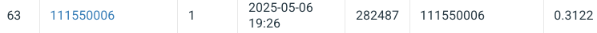

# NYCU Computer Vision 2025 Spring HW3

StudentID: 111550006

Name: 林庭寪

## Introduction

This project tackles instance segmentation on colored medical images, aiming to identify and segment four distinct cell types. The dataset includes 209 training/validation images and 101 test images in `.tif` format.

The core model is based on  **Mask R-CNN** , using a **ResNet-50 (or ResNet-50 V2)** backbone and a **Feature Pyramid Network (FPN)** for robust multi-scale feature extraction. To improve segmentation of  **cluttered or overlapping cells** , the model optionally includes **auxiliary heads** for predicting **cell center** and  **boundary maps** , inspired by approaches like  **CellPose** . These features are designed to guide the model toward more accurate and well-separated instance masks.

## How to Install

```bash
pip install requirements.txt
```

## How to Train the Model

See `train.sh` for some script templates for training.


| Flag                  | Type / Default                                                    | Purpose                                                                                                                   |
| --------------------- | ----------------------------------------------------------------- | ------------------------------------------------------------------------------------------------------------------------- |
| `--model_name`      | *str* ,`"unknown"`                                            | Optional tag that will be reflected in checkpoint filenames and TensorBoard runs.                                         |
| `--model_type`      | *str* ,`"resnet50"`;`choices = ['resnet50', 'resnet50_v2']` | Select the backbone version for Mask R‑CNN.                                                                              |
| `--pretrained_pth`  | *str* ,`""`                                                   | Path to a**custom** `.pth`file. Leave empty to use the ImageNet‑pretrained weights shipped with `torchvision`. |
| `--epochs`          | *int* ,`40`                                                   | Total number of training epochs.                                                                                          |
| `--w_center`        | *float* ,`0.5`                                                | Loss weight for the**center‑map**auxiliary head.                                                                   |
| `--w_boundary`      | *float* ,`0.5`                                                | Loss weight for the**boundary‑map**auxiliary head.                                                                 |
| `--batch_size`      | *int* ,`4`                                                    | Mini‑batch size per GPU (or per CPU if training on CPU).                                                                 |
| `--lr`              | *float* ,`1e‑4`                                              | Initial learning rate for the AdamW optimizer.                                                                            |
| `--with_train_map`  | *flag*                                                          | Add this switch to enable the center‑ and boundary‑map heads during training.                                          |
| `--customed_anchor` | *flag*                                                          | If present, the script will initialise the RPN with custom anchor sizes / ratios.                                        |
| `--data_root`       | *str* ,`data/train`                                           | Root directory that contains the `image.tif`and `class*.tif`folders.                                                  |
| `--save_dir`        | *str* ,`checkpoints`                                          | Where to save logs and model checkpoints.                                                                                 |

## How to Inference with Test Data

See `infer.sh` for some script templates for inferencing.


| Flag                 | Type / Default                   | Purpose                                                                                                          |
| -------------------- | -------------------------------- | ---------------------------------------------------------------------------------------------------------------- |
| `--img_dir`        | *str* ,`./data/test_release` | Folder that contains raw `.tif`test images.                                                                    |
| `--model_type`     | *str* ,`resnet50`            | Must match the backbone used during training (`resnet50`or `resnet50_v2`).                                   |
| `--model_path`     | **required** ,*str*      | Path to the saved `.pth`checkpoint you want to evaluate.                                                       |
| `--batch_size`     | *int* ,`8`                   | Inference batch size (tune according to GPU RAM).                                                                |
| `--with_train_map` | *flag*                         | Add if the checkpoint was trained**with**center‑/boundary‑map heads.                                     |
| `--output_dir`     | *str* ,`./result`            | Where `pred.json`and `pred.zip`will be written.                                                              |
| `--threshold`      | *float* ,`0.5`               | Confidence score cut‑off for keeping a prediction.                                                              |
| `--mask_threshold` | *float* ,`0.5`               | Pixel cut‑off (`> mask_threshold`) when binarising soft masks.                                               |
| `--mask_size`      | *int* ,`512`                 | If the model expects fixed 512×512 inputs, leave at 512; otherwise set to the resolution used during training. |
| `--num_classes`    | *int* ,`5`                   | Background + 4 cell types. Change only if you trained on different class count.                                |
| `--device`         | *str* , auto                   | `"cuda"`when a GPU is visible, otherwise `"cpu"`; you can override.                                          |

## Veirfy Format and Visualization

See ./verify for some visual results and coco_eval

## Performance Snapshot


